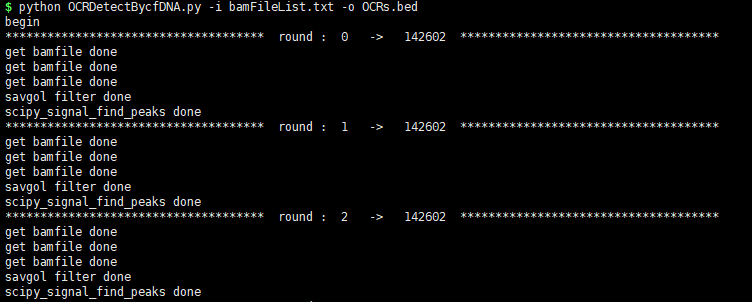
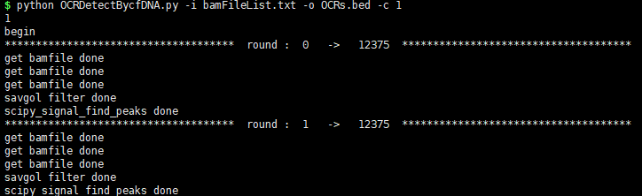
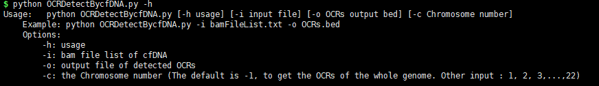
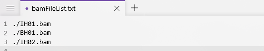

# OCRDetector 
*A novel bioinformatics pipeline named OCRDetector for detecting OCRs of the whole-genome based on cfDNA.*  

*The original name is OCRDetector*

*email- chenliubin@stu.xjtu.edu.cn*  

------

**Usage:**   

```shell
python OCRDetectBycfDNA.py [-h usage] [-i input file] [-o OCRs output bed]
```

**Options:**

```shell
	-h: usage

​	-i: bam file list of cfDNA

​	-o: output file of detected OCRs
```

------

**Example:** 

- `python OCRDetectBycfDNA.py -i bamFileList.txt -o OCRs.bed` or `python OCRDetectBycfDNA.py -i bamFileList.txt -o OCRs.bed -c -1`

  *The above command can calculate the OCRs of the whole genome*

  

- `python OCRDetectBycfDNA.py -i bamFileList.txt -o OCRs.bed -c -1`

  *The above command can calculate the OCRs of chromosome 1*

  

- `python OCRDetectBycfDNA.py -h`

  *View the usage of the software*



------

**Step1:**

First, you need to modify the content of the bamFileList.txt file and replace it with the path of your cfDNA-seq data. The input cfDNA-seq data file is of bam type and has been indexed.



**Step2:**

`python OCRDetectBycfDNA.py -i bamFileList.txt -o OCRs.bed`

**Step3:**

Extract features and train machine learning models to filter false positives.

**Step4:**

Use bedtools to calculate the intersection of our OCRs and OCRs obtained from other data (ATAC-seq, Dnase-seq, TSS).

------

***Waiting for subsequent updates***
